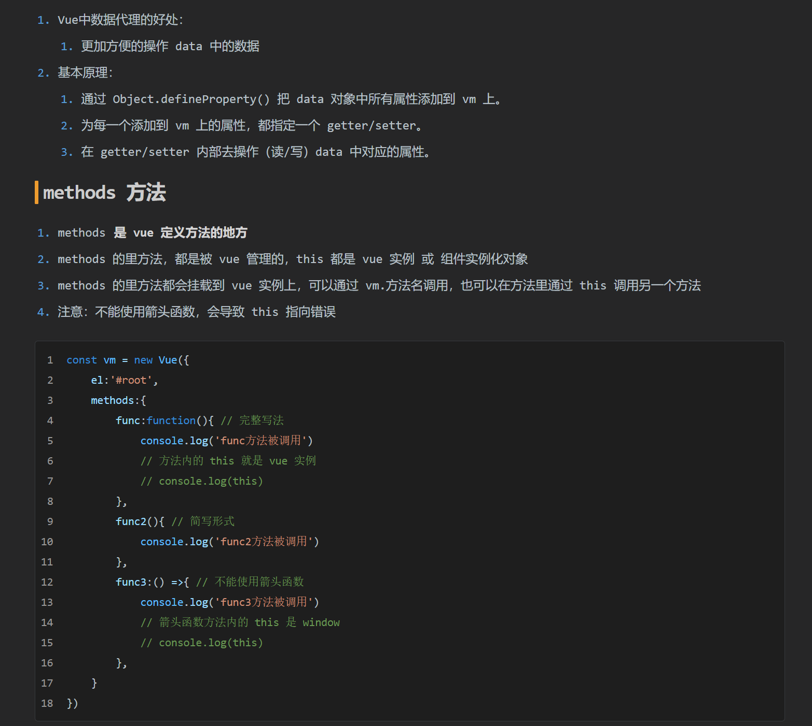
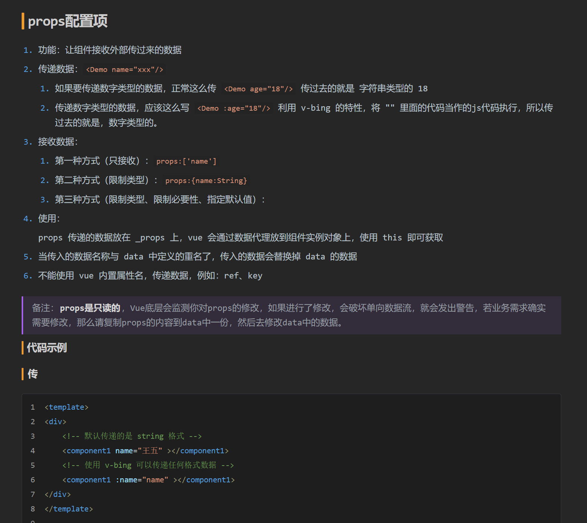

# 注：主题基于 Typora 内置主题 "Night" 改变而来，仅供学习

# 简介

主题大部分采用 Night 原始样式，在代码块、标题和引用块上有较大改变，代码块的色彩风格上更加接近 vscode，同时将标题和引用块以醒目颜色突出以体现重要性。背景采用比 vscode 白一点的颜色，减少和文字的明暗对比，以提升长时间的观看的体验。文字颜色在保证阅读性上调整为偏暗的颜色。调整了文字选中时的颜色不会有太大的明暗对比。

> 主题的配色很多都来自于网上，集合了很多网友的功劳，所以我觉得应该分享出来，说不定会有人需要。

# 效果展示

